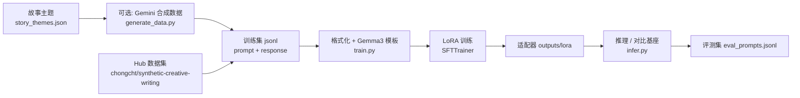

# 微调入门指南：用 Gemma 3 + Unsloth 学会「教模型写故事」

> 本文档面向**第一次接触微调**的读者，并**紧扣本仓库**（`fine-tuning-gemma-with-unsloth`）的代码与命令。读完后你应能说出：微调在解决什么问题、LoRA/SFT 是什么、数据长什么样、训练与评测怎么跑、以及如何判断「训好了没有」。

---

## 1. 先建立地图：大模型、微调、和本项目在做什么

### 1.1 大语言模型（LLM）在干什么？

可以把基座模型想成：**读过海量文本后，学会了「下一个词大概该是什么」**。  
**Instruct / Chat 模型**（如 `unsloth/gemma-3-270m-it`）则是在此基础上，又经过对话对齐，更擅长按「用户指令 + 系统角色」来回答。

本项目的目标很具体：**让 Gemma 3 270M 更像一位「短篇创意写作助手」**——用户给一个主题（prompt），模型写一段 concise 的故事（response）。

### 1.2 微调 vs 其它办法

| 方式 | 本质 | 适合场景 | 本项目的角色 |
|------|------|----------|--------------|
| **提示词工程** | 不改权重，只改输入 | 快速试想法、通用任务 | 训练/推理里固定的 `SYSTEM_PROMPT` |
| **RAG** | 检索外部知识再生成 | 事实、文档问答 | 本项目不涉及 |
| **微调（Fine-tuning）** | 用数据更新（部分）模型参数 | 固定风格、固定格式、垂直任务 | **核心** |
| **预训练** | 从零或继续在海量语料上训练 | 造新基座 | 不做（算力与数据都不现实） |

微调不是「让模型变聪明万能」，而是**在已有能力上，把行为往你的数据分布上推一把**——例如：更少废话、更像故事、更少拒绝写 fiction。

### 1.3 本仓库的端到端流程



**建议学习顺序：**

1. 看 3 条样本数据（`data/sample.jsonl`）→ 理解「一条训练样本长什么样」  
2. 跑 **冒烟训练**（10 step、3 条）→ 理解训练在改什么  
3. **推理 + `--compare-base`** → 用肉眼对比「训前 / 训后」  
4. 再读 `train.py` 里 LoRA、chat template、`train_on_responses_only`  
5. 可选：读 `generate_data.py`，理解数据从哪来  

---

## 2. 核心概念（小白版，但术语要对）

### 2.1 监督微调（SFT, Supervised Fine-Tuning）

给模型很多组 **「输入 → 期望输出」**，训练目标仍是语言建模：**在已给定的上文条件下，预测下一个 token**，但数据全是「你希望它这样回答」的例子。

本项目中，每条样本最终会变成一段带 Gemma 3 聊天格式的文本，字段名是 `text`（见 `train.py` 里 `formatting_prompts_func`）。

### 2.2 LoRA：只训一小撮参数

**全量微调**要更新模型全部权重，270M 虽小，仍占显存、也更容易「训歪」整个模型。  
**LoRA（Low-Rank Adaptation）** 在部分线性层旁加**低秩适配器**，训练时**只更新适配器**，基座权重冻结。

本项目的 LoRA 配置（`src/train.py`）要点：

- `r=16`：秩，越大表达能力越强，显存与过拟合风险也上升  
- `lora_alpha`：默认 `2 * r`（缩放）  
- `target_modules`：`q_proj, k_proj, v_proj, o_proj, gate_proj, up_proj, down_proj`（注意力 + MLP 常见做法）  
- 输出目录 `outputs/lora` 存的是 **适配器 + tokenizer**，不是完整复制一份 270M 基座  

可选 `--save-merged` 会把适配器**合并进**基座，得到可直接当普通 HF 模型加载的 `outputs/merged`（体积大，部署简单）。

### 2.3 QLoRA vs 本项目默认精度

**QLoRA** = 4bit 量化基座 + LoRA。270M 很小，**默认全精度训练**（`--no-load-in-4bit`），与原始 notebook 一致。显存紧张时可加 `--load-in-4bit`。

### 2.4 Chat Template 与 System Prompt

对话模型不直接吃裸字符串，而要套 **chat template**（特殊 token 标记 user/model 轮次）。  
本项目使用 Unsloth 的 `get_chat_template(..., chat_template="gemma3")`。

训练和推理使用**同一段**系统提示（storyteller），定义任务边界：

```python
SYSTEM_PROMPT = (
    "You are a master storyteller. Write a short, imaginative story based on "
    "the user's request. The story should be concise and suitable for a general audience."
)
```

**重要：** 推理时的 system / user 格式应与训练一致，否则效果会掉。

### 2.5 只算「回答部分」的损失：`train_on_responses_only`

若对整个序列（含 system、user）都算 loss，模型会浪费容量去「背诵提示词」。  
Unsloth 的 `train_on_responses_only` 让 **loss 主要作用在 model 回复段**（通过 `instruction_part` / `response_part` 与 Gemma3 的 turn 标记对齐）。

这是 instruct 微调里很常见、也很关键的一步。

---

## 3. 数据：本项目如何准备、长什么样

### 3.1 最简单格式：`prompt` + `response`

仓库里大部分 jsonl 是一行一个 JSON：

```json
{"prompt": "A robot who discovers music for the first time.", "response": "Unit 7 froze in the scrapyard..."}
```

- **`prompt`**：用户主题（对应 `story_themes.json` 里的一条）  
- **`response`**：希望模型学会生成的短篇故事  

`train.py` 的 `format_for_gemma` 还会把多种别名格式统一成 `conversations`（含 system / user / assistant），例如：

- `conversations`（多轮 role）  
- `instruction` + `input` + `output`（见 `data/sample.jsonl` 第 3 行）  

### 3.2 数据从哪来（三条路径）

| 优先级 | 来源 | 是否需要 GOOGLE_API_KEY |
|--------|------|-------------------------|
| 1 | 本地 `data/synthetic-creative-writing.jsonl` | 否 |
| 2 | Hugging Face `chongcht/synthetic-creative-writing`（`train` 默认） | 否（需能访问 Hub / 镜像） |
| 3 | `src/generate_data.py` 用 Gemini Batch 按主题重写 | 是 |

`generate_data.py` 逻辑摘要：

1. 读取 `data/story_themes.json`（约 100 个英文主题）  
2. `--multiplier 8` 时主题重复 8 次，便于 batch 规模与多样性  
3. 调用 Gemini 生成故事，写出 `prompt/response` jsonl  

训练前会 **过滤** 含 `"error"` 的 response（`has_error_response`），避免脏数据进 loss。

### 3.3 训练集 vs 评测集

- **训练集**：大量「主题 → 故事」对，教风格与任务  
- **评测集**：`data/eval_prompts.jsonl` 只有 **prompt**，并标注 `split`：  
  - `in_distribution`：与训练主题相近  
  - `held_out`：训练时没见过的主题（看泛化，不是背题）  

**Loss 下降 ≠ 写得好。** 本项目强调用 `infer.py --compare-base` **并排读故事** 来评判。

---

## 4. 训练：命令、超参、代码在做什么

### 4.1 环境准备

```bash
cp .env.example .env
# 国内建议保留 HF_ENDPOINT=https://hf-mirror.com（不要留空字符串）
docker compose build
```

Gemma 若为 gated 模型，需在 `.env` 配置有效的 `HF_TOKEN`。

### 4.2 推荐动手路径

**第一步：冒烟（几分钟内建立直觉）**

```bash
docker compose run --rm train \
  --dataset data/sample.jsonl \
  --max-steps 10 \
  --max-samples 3
```

**第二步：本地完整 jsonl（不依赖 Hub）**

```bash
docker compose run --rm train \
  --dataset data/synthetic-creative-writing.jsonl \
  --max-steps 100
```

**第三步：按 epoch 训一整遍数据**

```bash
docker compose run --rm train \
  --dataset data/synthetic-creative-writing.jsonl \
  --num-train-epochs 1
```

适配器默认写到 `outputs/lora`。

### 4.3 超参数速查（默认值即 notebook 取向）

| 参数 | 默认 | 小白怎么理解 |
|------|------|----------------|
| `--max-steps` | 100 | 更新权重多少次；小数据上 100 step 往往已能看到风格变化 |
| `--per-device-train-batch-size` | 8 | 每次 forward 多少条；显存不够就减小 |
| `--gradient-accumulation-steps` | 2 | 累积 2 个 micro-batch 再反传，等效 batch ≈ 8×2=16 |
| `--learning-rate` | 2e-4 | LoRA 常用量级；太大易不稳定 |
| `--warmup-steps` | 10 | 学习率先爬升，避免一开始炸 |
| `--lora-r` | 16 | 适配器容量 |
| `--max-seq-length` | 2048 | 单条样本最大 token；故事长要留足 |
| `--seed` | 3407 | 复现用 |

有效 batch size ≈ `per_device_train_batch_size × gradient_accumulation_steps × GPU 数`。

### 4.4 对照读代码：`train.py` 主流程

按执行顺序理解（建议打开 `src/train.py` 并排看）：

1. **`hf_setup` + `unsloth`**：必须在 transformers/trl 之前 import；清理空的 `HF_ENDPOINT`  
2. **`FastModel.from_pretrained`**：加载 `unsloth/gemma-3-270m-it`  
3. **`load_training_dataset`**：本地 json/jsonl 或 Hub 数据集  
4. **`format_for_gemma` → chat template → `text` 字段**  
5. **`get_peft_model`**：注入 LoRA  
6. **`SFTTrainer` + `SFTConfig`**：Hugging Face TRL 的监督微调训练器  
7. **`train_on_responses_only`**：只对 assistant 段算 loss  
8. **`save_pretrained`**：保存 LoRA 到 `outputs/lora`  

---

## 5. 推理与评测：怎么知道「训有没有用」

### 5.1 单次生成

```bash
docker compose run --rm infer \
  --prompt "A city where shadows have a life of their own." \
  --max-new-tokens 1024
```

若存在 `outputs/lora`，会自动加载适配器；否则用基座模型。

### 5.2 与基座对比（强烈建议）

```bash
docker compose run --rm infer --compare-base \
  --prompts-file data/eval_prompts.jsonl
```

结果默认写入 `outputs/compare.jsonl`，每行包含 `adapter` 与 `base` 的生成文本。

默认 **greedy 解码**（`--no-do-sample`）+ 固定 `--seed 3407`，是为了对比公平。要看多样性再加 `--do-sample --temperature 0.7`。

### 5.3 怎样算「好」（主观但可操作）

读 `held_out` 主题上的故事，可以问：

1. 是否**成篇**（是故事，不是提纲、免责声明、重复 prompt）？  
2. 是否**短而完整**（符合 system 里 concise）？  
3. 是否**贴题**（主题元素真的出现在情节里）？  
4. 相比 base，adapter 是否**更稳定地**做到以上几点？  

若只在 `in_distribution` 上好、`held_out` 上崩，可能是**过拟合**或步数过多——可减 step、减 `lora-r`、或增数据多样性。

---

## 6. 常见问题与排错

| 现象 | 可能原因 | 处理 |
|------|----------|------|
| 找不到 config / Hub 超时 | 网络或 `HF_ENDPOINT` 为空 | `.env` 设镜像；勿留空 `HF_ENDPOINT` |
| gated model 403 | 未接受 Gemma 许可 / 无 token | HF 网站同意条款 + `HF_TOKEN` |
| CUDA OOM | batch 或 seq 太长 | 减小 batch、`--max-seq-length`，或 `--load-in-4bit` |
| loss 很低但故事很烂 | 过拟合或评测方式不对 | 看 held_out；对比 base；别只看 loss |
| 推理像「没训过」 | system/template 不一致；加载错目录 | 确认 `outputs/lora` 存在且 infer 加载同一 template |

---

## 7. 延伸学习：从本项目再往外走

1. **TRL 文档**：`SFTTrainer` / `SFTConfig` 的其它选项（eval、packing 等）  
2. **Unsloth 文档**：更快训练、其它 chat template、合并导出 GGUF  
3. **PEFT / LoRA 论文**：理解 rank、target module 选择的含义  
4. **数据质量**：换 `story_themes.json`、改 system prompt、清洗 response，往往比盲目加 step 更有效  
5. **更大模型**：流程相同，但要重新权衡显存与 `--load-in-4bit`  

---

## 8. 术语表

| 术语 | 一句话 |
|------|--------|
| **Base model** | 预训练或官方发布的权重，如 `gemma-3-270m-it` |
| **Adapter / LoRA** | 训完的小补丁，加载在 base 上改变行为 |
| **SFT** | 用输入-输出对做监督微调 |
| **Token** | 模型读写的最小单位；长度限制用 token 计 |
| **Chat template** | 把多轮对话编码成模型输入格式的规则 |
| **In-distribution** | 与训练分布相近的测试 prompt |
| **Held-out** | 训练未覆盖的 prompt，测泛化 |

---

## 9. 自检清单（学完打勾）

- [ ] 能解释微调与「只改 prompt」的区别  
- [ ] 能写出一条合法的 `prompt/response` 训练样本  
- [ ] 跑通 `sample.jsonl` 冒烟训练并找到 `outputs/lora`  
- [ ] 用 `--compare-base` 生成 `compare.jsonl` 并解释 `held_out` 的意义  
- [ ] 说出 LoRA 训的是哪部分参数、为什么用 `train_on_responses_only`  
- [ ] 知道默认数据集、本地 jsonl、Gemini 重建三条路径的区别  

---

## 10. 本仓库文件索引

| 路径 | 作用 |
|------|------|
| `src/train.py` | LoRA + SFT 训练入口 |
| `src/infer.py` | 推理与 base 对比 |
| `src/generate_data.py` | 可选 Gemini 合成数据 |
| `src/hf_setup.py` | HF 环境与加载错误提示 |
| `data/sample.jsonl` | 3 条极小样本，适合冒烟 |
| `data/synthetic-creative-writing.jsonl` | 本地训练集 |
| `data/eval_prompts.jsonl` | 评测 prompt + split |
| `data/story_themes.json` | 故事主题列表 |
| `docker-compose.yml` | `train` / `infer` 服务 |
| `README.md` | 命令速查 |

更完整的命令示例以 [README.md](../README.md) 为准；本文侧重**概念与学习方法**。
